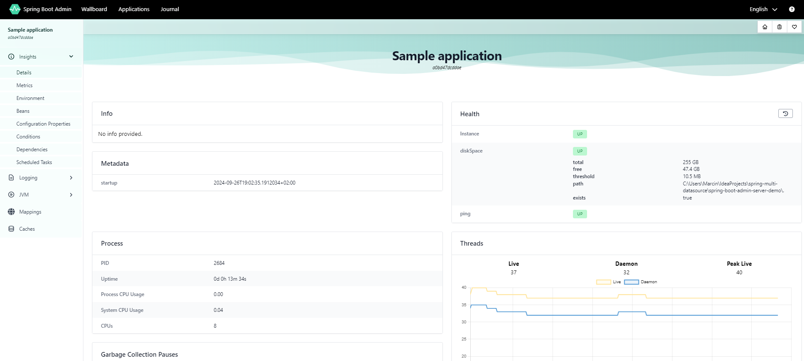

# Spring Boot Admin Server Demo

This is a demo project showcasing the use of Spring Boot Admin Server for monitoring Spring Boot applications. 
Spring Boot Admin provides a web interface to view details and metrics about applications registered in the server. 
This repository includes a simple Spring Boot Admin Server and a basic client application to demonstrate its features.

## Table of Contents

- [Overview](#overview)
- [Prerequisites](#prerequisites)
- [Getting Started](#getting-started)
- [Project Structure](#project-structure)
- [Features](#features)
- [Configuration](#configuration)

## Overview

Spring Boot Admin is a powerful tool for managing and monitoring Spring Boot applications. 
It provides an intuitive UI to track application health, view logs, check JVM metrics, and more. 

This demo project consists of two main parts:
1. **Spring Boot Admin Server**: Hosts the web interface for monitoring.
2. **Client Application**: Registers itself with the Admin Server to display various health and configuration details.

## Prerequisites

- Java 11 or higher
- Maven 3.6+
- Spring Boot 3.x.x or higher

## Getting Started

### Step 1: Clone the Repository

```bash
git clone https://github.com/marcinzygmunt-pl/spring-boot-admin-server-demo.git
cd spring-boot-admin-server-demo
```

### Step 2: Build and Run the Admin Server

Navigate to the `admin-server` directory and build the application:

```bash
cd admin-server
mvn clean install
mvn spring-boot:run
```

The Admin Server should now be running at `http://localhost:8080`.

### Step 3: Build and Run the Client Application

Open a new terminal window, navigate to the `client-app` directory, and run:

```bash
cd ../client-app
mvn clean install
mvn spring-boot:run
```

The Client Application will register itself with the Admin Server and should be visible on the server's UI.

### Step 4: Access the Admin Server UI

Go to [http://localhost:8080](http://localhost:8080) in your browser to view the Admin Server interface. You should see the registered client application with its details.



## Project Structure

- **admin-server**: The Spring Boot Admin Server project.
    - Hosts the Admin Server UI.
    - Exposes monitoring endpoints for registered applications.

- **client-app**: A sample Spring Boot application to demonstrate the integration.
    - Automatically registers itself with the Admin Server.
    - Exposes health and metrics information.

## Features

- **Monitoring Registered Applications**: View health, logs, environment variables, and more.
- **JVM and Thread Metrics**: Monitor JVM memory, threads, and garbage collection.
- **Health Checks**: Easily check the health status of all connected applications.
- **Log Management**: View and filter logs in real-time.
- **Custom Endpoints**: Extend functionality using custom endpoints.

## Configuration

### Admin Server Configuration

The Admin Server is configured using properties in `application.yml`.
For more detailed info visit [Server Documentation](https://docs.spring-boot-admin.com/current/server.html)
### Client Application Configuration

The client application is configured to register itself with the Admin Server using properties in its `application.yml` file:
For more detailed info visit [Client Documentation](https://docs.spring-boot-admin.com/current/client.html)